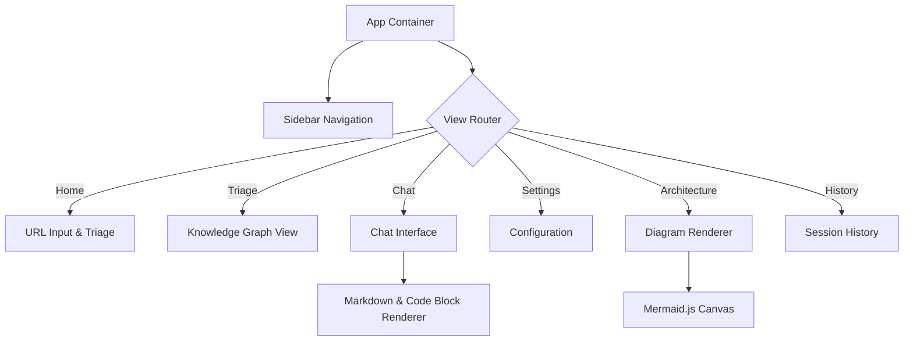

# Lumina MCP Agent - Architecture Documentation

## 1. System Overview

Lumina is a next-generation AI interface designed to bridge the gap between static documentation and active intelligence. It serves as a client for the Model Context Protocol (MCP), allowing users to "triage" web documentation into a structured context that can be queried, analyzed, and visualized.

The application is built as a **Single Page Application (SPA)** using React and TypeScript, emphasizing a "glassmorphic" and fluid UI design language. It integrates directly with LLM providers (Google Gemini, OpenRouter) to process natural language queries and generate architectural diagrams on the fly.

## 2. Core Architecture

### 2.1 Technology Stack

*   **Runtime Environment**: Browser-based (Client-side rendering).
*   **Build System**: Vite (Fast HMR and optimized bundling).
*   **UI Framework**: React 18.
*   **Styling**: Tailwind CSS (via CDN for portability) with custom animations.
*   **Language**: TypeScript (Strict mode).
*   **AI Layer**: 
    *   `@google/genai` for native Gemini integration.
    *   `fetch` for OpenRouter/OpenAI-compatible endpoints.
*   **Visualization**: Mermaid.js for rendering dynamic architecture diagrams.

### 2.2 Component Hierarchy



## 3. Data Flow & State Management

Lumina utilizes a decentralized state management approach using React Hooks and `localStorage` for persistence.

### 3.1 Session Persistence (`storageService.ts`)
*   **Chat Sessions**: Stored in `lumina_chat_sessions`. Includes message history, timestamps, and context URLs.
*   **Configuration**: Stored in `lumina_app_config`. Manages API keys, selected models, and provider preferences.

### 3.2 AI Request Flow (`geminiService.ts`)
1.  **Input**: User types a message or attaches a file in `ChatInterface`.
2.  **Context Injection**: If a URL was triaged, the system instruction is augmented with the context URL.
3.  **Routing**: 
    *   If Provider = Google -> Uses `GoogleGenAI` SDK.
    *   If Provider = OpenRouter -> Uses standard REST API.
4.  **Response**: Streamed or awaited text is parsed.
5.  **Rendering**: Markdown response is rendered; code blocks are highlighted; tables are formatted.

## 4. Key Modules

### 4.1 Triage Engine (`PageTriage.tsx`)
*   **Purpose**: Simulates the extraction of nodes (pages) from a documentation URL.
*   **Integration**: Prepares the "Context" that is fed into the Chat Agent.
*   **Visuals**: Displays a categorized list of found endpoints (API, Guide, Docs).

### 4.2 Architecture Generator (`ArchitectureView.tsx`)
*   **Purpose**: specialized prompt engineering to convert textual documentation into structured Mermaid.js code.
*   **Mechanism**:
    1.  Sends a "Architectural Analyst" prompt to the LLM.
    2.  LLM returns Markdown with ````mermaid` blocks.
    3.  `ArchitectureView` detects these blocks and uses `window.mermaid.contentLoaded()` to render them.

### 4.3 Voice & File Input
*   **Voice**: Uses the native Web Speech API (`webkitSpeechRecognition`) for real-time transcription.
*   **Files**: Reads text-based files via `FileReader` API and appends content to the prompt context.

## 5. Security Considerations

*   **API Keys**: Keys are stored exclusively in the user's browser `localStorage`. They are never transmitted to a backend server owned by Lumina (only directly to the AI Providers).
*   **Sanitization**: `react-markdown` is used to prevent XSS from generated content.
*   **Sandboxing**: Code execution is not performed locally; code snippets are for display only.

## 6. Future Roadmap

*   **Real MCP Connection**: Replace the simulated Triage with actual connection to `tomcp.org` or local MCP servers.
*   **Vector Database**: Implement client-side RAG (Retrieval-Augmented Generation) for larger documentation sets.
*   **Multi-Modal Inputs**: Allow image uploads for UI analysis.
